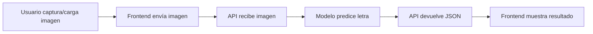

# 🧠 Proyecto de Reconocimiento de Lengua de Señas (ASL)

Sistema de **reconocimiento de señas del alfabeto en ASL (American Sign Language)** mediante visión artificial con **Python** y una interfaz web en **React + TypeScript + TailwindCSS**.

---

## 📁 Estructura del Proyecto
```
📂 Proyecto-ASL/
│
├── 📂 frontend/
│   └── 📂 asl_agent/          # Aplicación web (React + TS + Tailwind)
│       ├── src/
│       ├── package.json
│       └── vite.config.ts
│
├── 📂 gold_dataset/            # Datos de referencia y validación
│
├── 📄 api.py                   # API principal (Flask/FastAPI)
├── 📄 agent.py                 # Lógica del agente de predicción
├── 📄 tools.py                 # Utilidades del modelo
├── 📄 asl_model.h5             # Modelo entrenado (Keras/TensorFlow)
│
├── 📄 pyproject.toml           # Configuración de dependencias
├── 📄 uv.lock                  # Lockfile del entorno
├── 📄 .gitignore
├── 📄 .python-version
└── 📄 README.md
```

---

## ⚙️ Requisitos Previos

| Herramienta | Versión Mínima | Instalación |
|-------------|----------------|-------------|
| **Python** | 3.10+ | [python.org](https://www.python.org/downloads/) |
| **uv** | última | `pip install uv` |
| **Node.js** | 18+ | [nodejs.org](https://nodejs.org/) |
| **Git** | cualquiera | [git-scm.com](https://git-scm.com/) |

---

## 🚀 Instalación y Ejecución

### 1️⃣ Clonar el Repositorio
```bash
git clone <URL_DEL_REPOSITORIO>
cd Proyecto-ASL
```

### 2️⃣ Configurar el Backend

#### Instalar dependencias
```bash
uv sync
```

> Esto instalará automáticamente todas las dependencias definidas en `pyproject.toml`.

#### Ejecutar la API
```bash
uv run python api.py
```

✅ **Salida esperada:**
```
* Running on http://127.0.0.1:5000
* Press CTRL+C to quit
```

⚠️ **Importante:** Deja esta terminal abierta mientras trabajas con el frontend.

---

### 3️⃣ Configurar el Frontend

#### Navegar al directorio
```bash
cd frontend/asl_agent
```

#### Instalar dependencias
```bash
npm install
```

#### Configurar variables de entorno

Crea un archivo `.env` en `frontend/asl_agent/`:
```env
VITE_API_URL=http://127.0.0.1:5000
```

#### Ejecutar el servidor de desarrollo
```bash
npm run dev
```

✅ **Salida esperada:**
```
VITE v5.x.x  ready in xxx ms

➜  Local:   http://localhost:5173/
➜  Network: use --host to expose
```

---

## 🔄 Flujo del Sistema


### Respuesta de la API
```json
{
  "pred_letter": "W",
  "confidence": 0.6975,
  "feedback": "Asegúrate de extender el dedo anular más claramente. Los dedos índice, medio y anular deben estar bien separados..."
}
```

---

## 🛠️ Comandos Útiles

### Backend

| Comando | Descripción |
|---------|-------------|
| `uv sync` | Instalar/actualizar dependencias |
| `uv run python api.py` | Ejecutar API |

### Frontend

| Comando | Descripción |
|---------|-------------|
| `npm install` | Instalar dependencias |
| `npm run dev` | Modo desarrollo |

---

## 📊 Componentes Principales

### Backend

- **`api.py`**: Servidor HTTP que expone endpoints REST
- **`agent.py`**: Lógica de inferencia y procesamiento de predicciones
- **`tools.py`**: Funciones auxiliares para preprocesamiento de imágenes
- **`asl_model.h5`**: Modelo de red neuronal entrenado

### Frontend

- **React 18**: Framework de interfaz
- **TypeScript**: Tipado estático
- **TailwindCSS**: Estilos utilitarios
- **Vite**: Build tool y dev server
